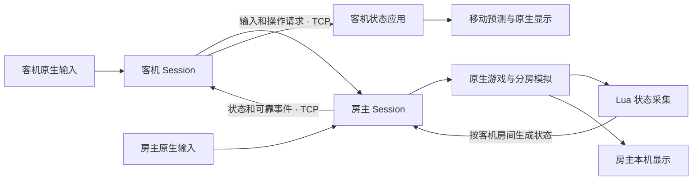

# 架构与技术选择

## 整体结构

Isaac LAN 在游戏进程中加载原生 DLL，并嵌入 Lua 桥接代码。房主运行原版玩法逻辑，客机提交操作、接收状态并显示自己的房间。

客机的状态包包含全队角色的主要状态、楼层地图和本机所在房间的实体、网格与表现。不同客机可以收到不同房间的视图。

## 状态同步

采用房主权威状态同步，避免各进程必须保持完整随机序列和执行顺序一致。客机应用房主状态，校验只检查数据格式、传输完整性和应用条件。

代价是状态处理与带宽开销。客机移动使用本机预测，伤害和道具效果仍等待房主结果。

## 原生集成

原生挂钩管理游戏更新、房间对象、输入、镜头和过场，Lua 桥接读取和应用实体状态。房间生成、战斗、道具效果、存档和多人 HUD 复用原版。

`winmm.dll` 自动加载 `isaac_lan_probe.dll`。桥接 Lua 在构建时嵌入 DLL。

## 网络传输

采用 IPv4 TCP、非阻塞套接字和 `TCP_NODELAY`，默认端口为 29506。利用有序交付处理状态分块、换层和检查点事务。

尚未开始发送的旧视图可由新视图替换；可靠事务保留顺序。已入队数据和 TCP 重传仍可能增加延迟。

## 模块边界

| 模块 | 职责 |
| --- | --- |
| [`app/`](../src/app/bootstrap.cpp) | 自动加载与启动装配 |
| [`engine/build.cpp`](../src/engine/build.cpp)、[`engine/versions/j460/`](../src/engine/versions/j460/entrypoints.h) | 游戏版本、PE 布局、入口校验及 J460 原生能力实现 |
| [`net/`](../src/net/session.cpp) | 连接、协议、消息队列、输入、状态与可靠事务传输 |
| [`runtime/`](../src/runtime/session.cpp) | 网络与游戏更新、换层、存档和会话生命周期协调 |
| [`bridge/app/world.lua`](../src/bridge/app/world.lua) | 组合状态组件、兼容规则和本机表现，维护视图身份与确认记录 |
| [`bridge/sync/`](../src/bridge/sync/world_schema.lua) | 显式字段、编码、库存及实体／网格同步组件 |
| [`compat/`](../src/compat/bosses/encounters.h)、[`bridge/compat/`](../src/bridge/compat/transitions.lua) | Boss、角色、道具、路线与第三方 Mod 适配 |
| [`presentation/`](../src/presentation/frontend.cpp)、[`bridge/presentation/`](../src/bridge/presentation/motion.lua) | 原生菜单、预测、镜头、角色外观与音画表现 |
| [`core/`](../src/core/intro_barrier.h)、[`diagnostics/`](../src/diagnostics/runtime_log.cpp) | 可移植规则、运行日志和隔离画面采集 |

具体依赖、所有权、原生后端尚存的耦合及新增兼容流程见[分层与玩法兼容](layers-and-compatibility.md)。

游戏对象、Lua 调用和网络轮询都在游戏主线程处理。

## 当前边界

- 引擎地址与布局针对 Windows 32 位忏悔＋ `v1.9.7.17.J460`。升级游戏需要重新核对入口和对象布局。
- 联机扩展指纹和协议版本必须一致；其他 Mod 的差异只做提示。
- 第三方 Mod 的内部 Lua 表和私有数据没有通用同步机制。玩法以房主为准，本机界面使用本机上下文。
- 房主不能迁移；整场联机续玩要求原人数、原加入顺序。运行中的客机重连使用保留的玩家标识。

协议细节见[网络与状态同步](synchronization.md)，房间和表现的边界见[分房模拟与本机显示](rooms-and-presentation.md)。
