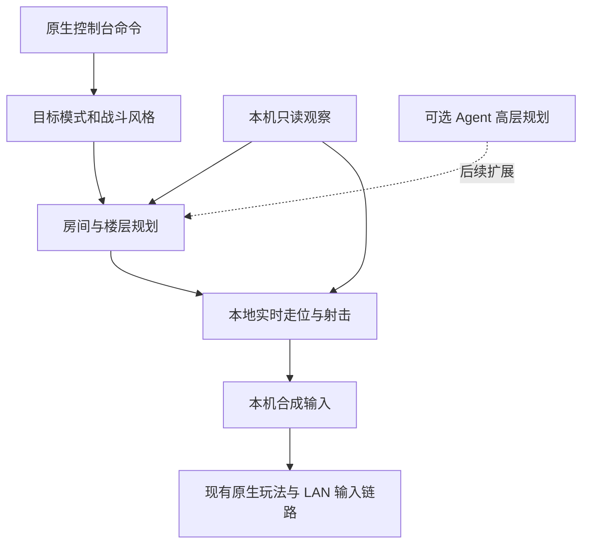

# LAN 人机托管设计

状态：初版代码与离线测试已实现；本次补齐探索完成条件、进房离门任务、出口触碰保护、普通按钮与交替尖刺判断，并抽出连续危险预测。通过范围和未完成项见[使用说明](lanbot.md#本次优化验证)，以下验收目标不代表全部通过。关联需求：[Issue #10](https://github.com/BMingSY/isaac-lan/issues/10)。

通过游戏原生控制台的 `lanbot` 命令，把当前机器所属玩家的操作交给人机。人机能够连续战斗、拾取、探索、过门和推进楼层，并支持切换目标、战斗风格，以及暂停、恢复或结束托管。主要使用方式是人机操作主机，测试者手动操作客机，观察客机的状态同步、输入和画面。

人机模块随 LAN 扩展内置，不需要额外安装 Mod，也不需要外部控制程序。主客机仍各自运行真实游戏进程；人机只提供操作输入，原版游戏和现有 LAN 同步链路继续处理玩法。

## 第一版范围

主机和客机都可以托管，但只接管发出命令的机器所属玩家。主机托管不会顺带操作客机角色，同房间里的队友也不会被接管。

第一版包含通关、自由探索和留守三个目标模式，激进、均衡和保守三种战斗风格。首次执行 `lanbot on` 默认使用通关目标和均衡风格，清房后继续收集与探索，不要求测试者逐个房间指挥。

自主流程包括正常走门、免费资源与道具拾取、Boss 战斗和通过现有出口进入下一层。多人 Boss 奖励每次自动领取至多一份，剩余奖励留给队友。付费交易、需要主动使用炸弹或特殊物品的解谜路线，先交还人工处理；真人可以在托管时触发道具操作，也可以暂停后接管。

战斗以有障碍的寻路、短时危险预测和武器射程适配为基础，优先验证普通泪弹角色和阿撒泻勒，并覆盖持有与松开射击的蓄力行为。特殊武器、双角色和 Mod 内容按实际支持规则与测试结果说明，不把完成简单射击等同于通关能力。

人机通过正常输入行动，不直接改位置、血量、道具或敌人状态，不提供无敌、自动复活和瞬移。通关目标沿本局可达的普通路线推进；需要特定道具或特殊解谜的分支、贪婪模式与特殊挑战不纳入第一版完整通关范围。遇到尚未支持的必要操作时报告具体原因并等待人工处理。

## 原生控制台入口

使用前需要关闭游戏，在当前存档配置目录的 `options.ini` 中设置 `EnableDebugConsole=1`，再启动游戏。Windows 忏悔＋默认配置路径为 `C:\Users\<用户名>\Documents\My Games\Binding of Isaac Repentance+\options.ini`；重定向存档的测试副本使用自己的配置目录。[控制台启用说明](https://wofsauge.github.io/IsaacDocs/rep/tutorials/DebugConsole.html)、[忏悔＋配置位置](https://wofsauge.github.io/IsaacDocs/rep/faq/GettingStarted.html#how-do-i-open-the-debug-console)。

正常进入 LAN 游戏后，用游戏原生按键打开控制台，直接输入 `lanbot on`。关闭控制台后人机开始操作；不需要输入 `lua`、调用内部函数、安装额外 Mod 或启动外部命令行工具。扩展不自动修改玩家的控制台设置。

同机双实例测试时，主机应能够在失去窗口焦点后继续运行。隔离测试配置沿用已有的 `PauseOnFocusLost=0`；正式测试时也要使用允许后台继续运行的配置。人机不能依靠抢占窗口焦点或向客机窗口发送键盘事件控制主机。

## 模式与风格

目标模式决定接下来做什么，战斗风格决定为此愿意承担多少风险，两者独立设置。例如 `run + cautious` 表示保守推进通关，`explore + aggressive` 表示积极探索。

| 目标模式 | 清房后的行为 | 适用场景 |
| --- | --- | --- |
| `run` 通关 | 收集必要资源，寻找有价值的补给与 Boss 路线，击败 Boss 后推进楼层，直到本局普通路线终点 | 主机持续游玩，客机观察完整流程 |
| `explore` 自由探索 | 遍历当前层可达且值得探索的房间，收集资源；探索完毕后等待，不自行换层 | 客机测试分房、特殊房间和楼层状态 |
| `hold` 留守 | 只处理当前房间的战斗和必要恢复，清房后留在房间，不主动过门 | 客机独立测试 Boss 动画、死亡和分房问题 |

| 战斗风格 | 策略差异 |
| --- | --- |
| `aggressive` 激进 | 更积极占据有效射程与射击路线，优先击杀高威胁目标，减少非必要绕路；仍避开预计碰撞和致命风险 |
| `balanced` 均衡 | 综合预计受伤、输出机会和路线效率，是默认风格 |
| `cautious` 保守 | 更大危险裕量，优先保持退路和补血，主动避开有代价的支路；仍使用适合当前武器的有效射程 |

风格通过危险权重、距离裕量、目标优先级和资源取舍改变实际行为，不能仅修改名称。保守不等于停在射程外，激进也不等于撞向敌人。

`run` 的普通换层默认等待其他在线、已就绪且存活的玩家到达出口所在房间，避免直接打断客机正在进行的测试。等待时显示 `wait_for_party`，不因为超时就自行换层。`explore` 探索完毕也在当前层等待。可以执行 `lanbot next` 让本机沿正常路线前往已存在的可用出口并尝试推进；命令不生成出口，也不绕过原版和现有 LAN 的换层限制。`hold` 模式拒绝该命令，需先切换模式。

模式不是游戏路线选择器；出现多个可用出口时使用稳定的普通路线优先级，不能根据未知内容猜测特殊结局路线。无可用路线或缺少钥匙等资源时显示原因，允许手动处理后继续。

## 控制台命令

| 命令 | 行为 |
| --- | --- |
| `lanbot on` | 开启本机托管；首次默认 `run + balanced`，后续沿用当前会话配置；运行中重复执行不会叠加控制器 |
| `lanbot mode run\|explore\|hold` | 设置目标模式，可在关闭、运行或暂停时设置；切换时清除旧任务并按新目标重新规划 |
| `lanbot style aggressive\|balanced\|cautious` | 设置战斗风格，可在关闭、运行或暂停时设置；运行时立即影响下一次决策 |
| `lanbot pause` | 暂停托管，释放人机按键，恢复人工输入；保留模式和风格 |
| `lanbot resume` | 从暂停状态恢复，重新读取当前角色和房间；运行中重复执行保持原状态 |
| `lanbot off` | 结束托管，释放人机按键并清除目标、路径及任务，恢复人工输入 |
| `lanbot next` | 在运行中的 `run` 或 `explore` 模式提交一次正常出口推进任务，省略本次等待队友的条件 |
| `lanbot status` | 显示托管状态、本机主客机身份、目标模式、战斗风格、当前任务及等待原因 |
| `lanbot help` | 显示命令说明；不带参数的 `lanbot` 同样显示帮助 |

`on` 和 `resume` 只在已经进入游戏的 LAN 会话中执行；大厅、单机或会话已结束时报告不可用。`resume` 在关闭状态下提示先执行 `lanbot on`。`pause` 和 `off` 重复执行保持对应状态。`status`、`help` 和 `off` 在尚未开局时也可使用。

`mode` 和 `style` 设置不自动开启或恢复托管；`off` 清除任务，但保留本次会话的模式和风格。退出、重连或下一局恢复默认配置。`next` 在暂停、关闭、留守模式或无可用出口时报告原因，不自动更改模式或托管状态。

命令只作用于本机，不增加远程接管命令。参数枚举、数量和状态均需检查，未知子命令或多余参数只输出错误与帮助，不修改状态。

反馈示例：

```text
LANBOT running role=host mode=run style=balanced task=attack
LANBOT running role=host mode=run style=cautious task=move_to_door
LANBOT running role=host mode=run style=cautious task=wait reason=wait_for_party
LANBOT paused role=host mode=run style=cautious
LANBOT off
```

`pause` 暂停的是人机托管，命令本身不触发全局游戏暂停；关闭控制台后，主机模拟和网络会话照常运行。`off` 撤销的是托管，已经发生的移动、伤害、拾取和游戏进度继续保留。

## 使用流程

1. 在启动游戏前开启原生控制台，用正常 LAN 菜单创建房间并让客机加入，正常开始游戏。
2. 在主机原生控制台执行 `lanbot on`，关闭控制台后切到客机游玩。主机自主探索、战斗、拾取和寻找出口。
3. 按需执行 `lanbot mode explore` 或 `lanbot style cautious`，改变探索目标或战斗取舍。
4. 需要调整主机位置、道具或房间时，在主机执行 `lanbot pause`，手动完成操作后执行 `lanbot resume`。
5. 测试结束或需要持续人工操作主机时，执行 `lanbot off`。

测试分房 Boss 动画、客机死亡或双生宝问题时，先执行 `lanbot mode hold`，让主机保持自己的房间，再从客机执行复现步骤。测试连续探索时改回 `run` 或 `explore`。人机不会因客机死亡而重开或直接修改客机角色。

示例命令顺序：

```text
lanbot on
lanbot style cautious
lanbot mode explore
lanbot pause
lanbot resume
lanbot off
```

## 状态与生命周期

| 状态 | 玩法输入来源 | 恢复方式 |
| --- | --- | --- |
| 关闭 `off` | 人工输入 | `lanbot on` |
| 运行 `running` | 人机提供移动和射击，其他人工操作保留 | `lanbot pause` 或 `lanbot off` |
| 暂停 `paused` | 人工输入，模式和风格保留 | `lanbot resume` 或 `lanbot on` |

运行状态下的任务包括战斗、拾取、走向门口、探索、走向出口和等待；等待原因包括视图准备、角色复活、队友汇合、资源不足及路线受阻。等待不改变显式的运行／暂停状态，`status` 显示原因。

- 清房后，停止射击，按目标模式选择拾取、探索、出口或留守。同房间再次出现可攻击目标时优先重新判断危险。
- 开启控制台、菜单或全局暂停时停止人机输出，保留人工界面输入。回到正常玩法后重新判断。
- 换房时清除局部路径和旧按键，保留当前层已观察的探索记录；换层和沙漏等世界重建时重建记录，等待当前视图就绪。运行状态随后恢复决策，显式暂停状态保持暂停。
- 本机角色死亡或变成幽灵时停止人机输出；通过正常玩法复活后重新绑定角色。人机不自行复活或重开。
- 退出、断线、回到大厅或结束整局时关闭托管。重连和下一局需要重新执行 `on`，不保存到游戏存档。
- 决策报错时释放人机按键并转为暂停，保留日志供定位，人工输入继续可用。

房间、角色和世界身份必须取当前会话上下文。角色替换、复活和双角色变化后重新获取本机所属角色，不缓存旧实体地址，也不把 `Isaac.GetPlayer(0)` 当作本机玩家。

## 本地决策与 Agent 扩展

第一版采用本地规划和实时走位，无需远端 Agent。把可选 Agent 放在低频的路线与目标规划层，移动、瞄准和躲弹始终由本地实时逻辑处理。



### 房间与楼层规划

维护当前层的已观察房间、门连接、访问次数、清理状态和资源需求。使用本机已访问房间、可见地图与当前门信息规划，不依靠主机权威进程的便利偷读所有未探索房间内容。房间与维度共同组成节点，未知分支通过正常探索逐步建立。

`run` 根据生存资源、补给价值、路程和 Boss 目标选路，清房后继续前进，完成当前层正常可达分支后才规划出口；`next` 可以提前提交一次出口任务。`explore` 优先未探索的可达分支，通过已知连通图返回尚未走过的岔路；记录失败边和访问次数，避免在两个房间之间来回循环。`hold` 的路线终点始终在当前房间。

门与出口是明确的动作目标。走到门口后继续沿正确方向输入，等待实际房间或楼层身份变化才算到达；Boss 播报和换层动画期间停止旧房间操作，不能用固定按键时长假定已经过门。进入门口通道前清除战斗绕行目标，进房后保留离门任务直到向房内移动至少 70 个坐标单位，再恢复普通选路。门连接以本次观察替换旧记录，失败目标按来源房间隔离；目标接近时保留短期选路偏好，防止无目的折返。

出口的触碰圆独立于网格碰撞，覆盖地板出口、楼梯、光柱和大宝箱；只授权当前出口目标，普通寻路与避险不能越过其他出口，已重叠时允许向外恢复。

普通压力按钮在没有战斗目标时优先于清房等待，按实际 State=3 确认完成，不以靠近或计时猜测激活。交替尖刺按房间模拟 tick 观察完整收起区间，以最短已观察区间减去裕量判断剩余窗口；错过观察、换房／换层、角色替换或 tick 回退使缓存失效。空间上可达但窗口不足时先靠近安全等候点，任务等待不算寻路失败；静态障碍仍进入失败冷却。清房后 State=1 且原生 Timeout<0 的交替尖刺保持收起，直接允许通过。

免费资源按当前需要选择，缺血时优先可达的恢复物，满资源时减少无意义拾取；付费或具有未知代价的对象不当作普通掉落。门需要钥匙时计入资源预算，缺少资源则换路或报告原因。重复拾取与已消失目标立即失效。

### 实时走位与战斗

新增独立的 Lua 观察、规划和战斗模块。观察使用现有本机视图和角色身份能力，读取本机房间内角色位置与速度、敌人、弹幕、激光等危险对象，以及房间网格、通行范围和当前武器属性；不修改世界，也不消费游戏随机数。

走位采用两步：先根据网格与角色通行能力规划可达路线，再每个渲染帧评估接下来一小段时间的实际移动，绕开动态危险。网格寻路可用 A*，考虑角色碰撞半径、飞行、坑洞、尖刺和障碍，避免只朝目标直线移动或从两个障碍之间斜穿。房间 API 提供网格碰撞查询和不同用途的视线检查，可作为通行与射击判断依据。[Room API](https://wofsauge.github.io/IsaacDocs/rep/Room.html#checkline)。

实时层对八个移动方向与不移动分别做短时轨迹评估，考虑当前位置、速度、减速和转向惯性，不能假定松手立即静止。预测近处敌人与弹幕的移动，使用每段相对轨迹的最短距离，补偿客机状态年龄；到达路径点后继续评估减速尾段，避免提前截断预测。已识别的激光、爆炸、地面危险和 Boss 预兆也加入危险区域。轨迹采样期间检查障碍与可撤退空间，避免躲过一颗弹幕后撞向另一颗、退入墙角或跌入坑洞。

先排除无法通行的轨迹，再综合预计受伤、退路、有效射程、射击机会和目标进度选动作。紧急躲避优先于拾取和过门；风险无法完全避免时选择预计损失最小的动作，不靠不动掩盖失败。保持短期方向和目标稳定性，只有风险或收益明显变化时切换，减少左右抖动。敌人带有 FLAG_NO_TARGET 时保留接触危险，取消攻击目标；客机也遵守该标记。

射击目标结合威胁、可攻击阶段、距离和视线判断，避免攻击无敌实体或持续对着墙射击。根据武器射程调整距离；普通泪弹持续射击，蓄力武器保留充能与松开状态。激进和保守风格改变这些取舍，但都保持有效输出。掉血后重新评估恢复、退路和目标。

短时间没有位移时重新寻路并尝试其他可行方向；对重复失败的路径加冷却，必要时选其他门或目标。全部候选目标都受阻时释放输入并报告 `route_blocked` 或 `needs_manual`，不会无限按住同一方向。

客机复制实体可能关闭玩法碰撞，目标识别不能只依赖 `IsVulnerableEnemy()`；需要区分敌人、弹幕、拾取物及不可攻击对象。复制状态也可能滞后，因此危险评估考虑观察年龄并增加对应裕量，不启用客机敌人模拟。

实时决策按渲染帧去重，输入采集和预测复用同一结果。楼层规划低频或事件触发，局部路线在障碍或目标变化时更新；限制候选数量、扫描范围、预测长度和寻路展开次数。记录实时决策耗时、受伤次数、受阻次数、任务耗时和过门结果；目标是实时决策单次预算 2 ms，实测超出预算时优先保留危险判断、减少非必要规划，不能阻塞网络轮询。

所有缓存绑定整局、世界代次、本机房间和角色集合；失效时先清空旧输入。实时输出携带生成帧和有效期限，不能一直沿用过期方向。

### 可选 Agent 的边界

第一版保留高层规划接口，不接入外部服务或要求 API Key。先验证本地方案的生存、连续探索与通关表现，再决定是否需要 Agent 补充特殊路线、道具选择或测试任务编排。

后续 Agent 只接收精简观察并返回下一阶段目标，不逐帧生成按键。请求异步执行，主线程只读取已经完成的结果；本地走位持续运行，超时、断线或无结果时使用本地规划。结果携带整局、代次、房间和任务版本，验证可达性与资源后使用，过期结果丢弃。这样 Agent 的响应时延不会进入射击和躲弹循环。

## 原生输入接管

在现有原生输入层增加本机输入来源选择。先采集真实输入，再在托管运行且玩法可用时用人机值替换移动和射击；人工输入与人机输入不按最大值混合，避免相反方向同时生效。

人机接管动作 0–7，即移动和射击。地图、暂停、菜单、控制台以及真人触发的炸弹、道具、卡牌等操作继续使用真实输入；人机不生成这些操作。

输入发送和客机本地移动预测必须使用同一份合成输入。不能只替换 Lua 的网络采集结果而让预测继续使用真实按键，也不能只改引擎玩法查询而绕过 LAN 输入提交。

持有值与按下边沿分开处理。边沿根据合成输入的变化产生并保留到正常采集，半帧更新不重播；暂停、关闭和世界失效时清掉人机持有值及尚未提交的边沿，保留真实界面操作。

主机将自己的合成输入交给现有 `Session::submit`，继续由原生多人逻辑处理；客机使用现有输入消息发送到主机，接收正常权威结果。房间尚未就绪时沿用现有零玩法输入约束。

局域网对端已经接收的输入按正常更新顺序消化，命令不能撤回已发送的操作。停止托管后不再产生新的旧任务输入。

## 模块落点

| 位置 | 计划变更 |
| --- | --- |
| `src/bridge/lanbot.lua` | 命令、状态机、模式与风格配置，协调各决策模块 |
| `src/bridge/lanbot/` | 本机观察、房间与楼层规划、网格寻路、实时危险评估及武器策略 |
| `lanbot/terrain.lua`、`lanbot/hazards.lua` | 地形与按钮 API 适配、周期缓存；纯数值连续碰撞预测 |
| `src/bridge/app/main.lua` | 接入控制台命令、本机决策和会话清理 |
| `src/engine/versions/j460/input.cpp` 与 `.h` | 合成人工／人机输入，统一采集与预测入口，清理边沿 |
| `src/runtime/session.cpp` | 按需要接入输入刷新时序、玩法可用状态及控制台可见性，不新增消息类型 |
| `CMakeLists.txt` 与嵌入桥接配置 | 将人机模块随 DLL 打包，登记必要测试 |
| `tests/` | 命令、观察适配、规划、战斗与输入契约测试；真实双实例场景另行验收 |

内部 Lua／原生接口只服务内置人机模块，第一版不扩展第三方公开 API。采用现有输入结构和协议；主客机仍需要同一扩展构建。正式安装环境可以使用 GM 命令，不依赖 `.isaac-lan-lab` 标记或 `test_gamepad` 测试接口。

## 验收

| 验证项 | 通过条件 |
| --- | --- |
| 原生控制台 | 开启控制台配置后，从真实游戏控制台直接执行 `lanbot on` 进入托管；无需内部函数、测试专用入口或外部程序 |
| 命令与状态 | 开启、重复开启、模式／风格切换、暂停、恢复、关闭、推进和非法命令均符合约定；不重复注册控制器 |
| 输入切换 | 相反的人工／人机方向不叠加；暂停和关闭后无旧方向、旧射击或重复按下边沿 |
| 本机归属 | 2 人及 4 人会话只托管本机所属玩家；主机不会操作队友；双角色不会误认队友为本机 |
| 通关目标 | 主机自主探索、拾取、走门、打 Boss 和正常换层；在出口正确等待队友，解除等待后继续推进 |
| 探索与留守 | `explore` 覆盖可达分支且不反复绕圈或自行换层；`hold` 不主动离房；切换模式取消旧路线 |
| 风格差异 | 在同一观察场景下，激进、均衡和保守的距离、目标或风险取舍有可解释差异；都能保持有效射击 |
| 走位质量 | 可避开的测试弹幕和冲撞得到提前规避；障碍、坑洞、墙角和门口场景没有持续撞墙、抖动或意外过门；受阻后能够重新规划 |
| 客机托管 | 本地预测与发给主机的输入一致；复制实体的目标识别不依赖已关闭的玩法碰撞 |
| 界面与暂停 | 托管期间仍能打开控制台并执行关闭命令，地图和暂停菜单接受真人输入；`lanbot pause` 不触发全局暂停 |
| 生命周期 | 换房、换层、死亡、复活和角色替换后不沿用旧目标；退出、断线和重连不残留托管 |
| 性能与新鲜度 | 实测记录决策耗时，验证预算与候选数量限制，过期缓存不继续操作，网络更新不等待外部结果 |
| 真实画面 | 同时记录主客机，检查人机移动、射击、清房等待和人工接管；场景失败如实报告 |

无需游戏的测试覆盖命令状态机、目标与风格差异、未知门逐步探索、环路退出、网格寻路、动态危险、受阻恢复、缓存过期及输入合成契约，并覆盖连续多帧移动至过门。Windows 构建验证编译与链接；真实控制台场景必须走原生命令入口，不能仅直接调用人机模块冒充入口通过。J460 使用原生命令分发桥接到同一 Lua 命令处理函数，并在联机中按本地渲染帧处理控制台。

后续默认执行无需游戏的回归，尽量减少实机运行。原生入口、引擎接口或版本变化无法由离线检查确认时，再选择定向的隔离场景。“人机主机＋人工／正常输入客机”为主要组合；普通泪弹角色和阿撒泻勒的不同种子、连续两层与整局通关、客机托管、4 人归属、延迟中继和主机失焦运行作为按需的扩展验收，不要求每次提交执行。

走位单独使用有障碍、追逐敌人、交叉弹幕及 Boss 危险区的场景，记录受伤、房间耗时、受阻与意外过门。与现有简单战斗规则使用相同场景对照，检查是否减少可避免的受伤与卡住；不能只以最终击杀敌人判断人机聪明。失败尝试和依赖人工处理的步骤也需记录，不宣称所有种子、角色或特殊结局都能自动完成。

现有 `tools/manual_gameplay.py` 的移动、射击、简单躲避与双端记录能力可复用为参考和验证工具，但固定种子、双阿撒泻勒路线不能单独证明通用人机行为通过。

## 交付顺序

本次交付包含原生控制台、输入接管、本地战斗与楼层探索／推进代码，以及模拟观察、持续行为、输入契约、语法与构建验证。有限的实机检查已验证主机命令与接管切换；门前停滞修复尚未实机复测，走位效果对比与通关记录未完成。后续按用户要求优先扩充快速测试。

提交关联 Issue #10 的 PR，并列明已经通过的检查与待完成的实机验收。外部 Agent 接入是后续可选扩展，不作为基础托管的运行依赖。

闭合的 Boss 出口不会成为推进目标：地形适配读取原版网格状态，闭合时保持 50 像素区域保护（再加角色半径），规划安全等候点，使角色主动向外退开；等待原版开启后恢复通常出口保护半径，再由选定推进任务碰撞。不改出口状态或原生换层逻辑。

大宝箱的 Lua `Wait` 与原版内部的碰撞延迟不是同一字段。原版延迟仍为正时，持续接触会把它重置为 10 次更新。LANBOT 只读取正常 API 的宝箱状态及同房间存活角色位置：选定尚未触发的大宝箱后，先退到安全点，等同房间角色均离开接触区域，并观察至少 15 个权威同步 tick 后再靠真实输入重新接触。使用已有 `api_info.tick`，客机与主机无需新增协议字段；角色鬼魂不阻碍等待。若接触后长时间仍未触发，重新退开等待；换房、换层及暂停／重启托管清理等待状态。不写宝箱状态、计时器或角色坐标，也不直接调用结局。
