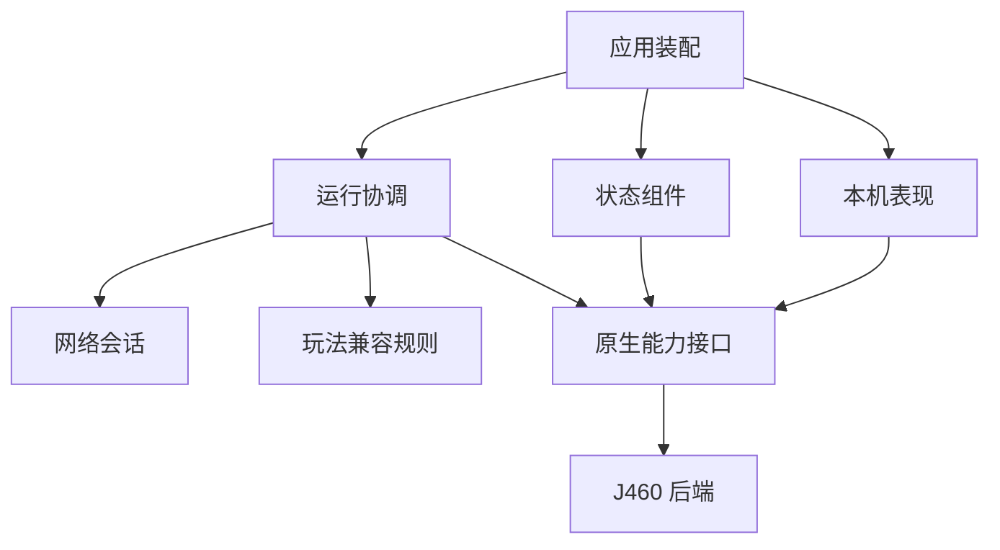

# 分层与玩法兼容

这次整理把传输、运行协调、状态组件、表现和版本后端分开，并抽离现有特殊玩法规则。房主继续运行权威玩法，客机显示权威状态；协议为 24，世界视图为 schema 12。已有联机指纹检查仍要求两端使用相同扩展。

## 目录与职责

| 位置 | 职责 | 主要入口 |
| --- | --- | --- |
| `src/app/` | 加载器与原生启动装配 | `loader.cpp`、`bootstrap.cpp` |
| `src/net/` | 协议、TCP 会话、消息队列和压缩 | `protocol.h`、`session.cpp` |
| `src/runtime/` | 会话推进、存档保护、纯房间／角色规则 | `session.cpp`、`actor_roster.h`、`room_map.h` |
| `src/engine/` | 原生能力接口与版本校验 | `rooms.h`、`input.h`、`save.h`、`build.cpp` |
| `src/engine/versions/j460/` | J460 原生调用、布局、所有权与 Hook 实现 | `entrypoints.h`、`profile.h`、`signatures.inc`、`rooms.cpp` |
| `src/compat/` | 可离线执行的原生玩法策略 | Boss 汇合、角色特征、沙漏目标、矿二追逐 |
| `src/presentation/` | 原生菜单与界面接入 | `frontend.cpp` |
| `src/core/` | 可移植的输入、表现及日志数据规则 | 输入边沿、激光路径、音效归属等 |
| `src/diagnostics/` | 运行日志与隔离画面采集 | `runtime_log.cpp`、`lab_capture.cpp` |

Lua 按同样的职责组织在 `src/bridge/`：

| 位置 | 职责 |
| --- | --- |
| `app/main.lua` | 开局、恢复、游戏回调与第三方 API 的装配 |
| `app/world.lua` | 按规定顺序组合状态采集、应用和本机表现；维护视图、实体引用与确认历史 |
| `sync/` | 数据编解码、字段 schema、库存／实体／网格的通用同步组件 |
| `runtime/` | 楼层代次屏障、可靠转场和进房边界 |
| `presentation/` | 精灵、角色外观、音效、插值、移动预测、道具演出和菜单 |
| `compat/bosses/` | Boss 房进房补充规则、教条光束预警几何状态 |
| `compat/characters/` | 里拉撒路对象替换、里小蓝人消耗品队列 |
| `compat/items/` | 沙漏和 R 键的转场选择、全队黑蜡烛的诅咒清除规则 |
| `compat/routes/` | Home 昼夜与教条过场规则、特殊房间返回上下文、贪婪波次 |
| `compat/mods/` | Stats+、GoodTrip、EID 及第三方自动适配注册机制 |
| `api/` | 对第三方 Mod 公开的本机视图、生命周期和主机动作接口 |

## 依赖与装配

网络层不读取游戏对象、不识别角色或 Boss、不调用 Lua。原生兼容策略只接收普通值或自有容器，不访问游戏内存，不安装 Hook。Lua 组件通过工厂接收原生能力、字段定义或回调；`app/world.lua` 负责组合这些组件。修改表现不会使 TCP 会话知道音乐、装扮或预测规则。

图表示职责关系，并不意味着所有原生依赖已经单向化。J460 Hook 仍会回调会话协调器，`runtime/session.cpp` 和原生前端仍保留部分版本相关访问与调用约定；房间上下文切换及原生所有权处理仍由版本后端统一实现。进一步拆分时先提取具名能力接口并验证调用时机，不能把这些访问直接放进通用兼容策略。

嵌入组件清单集中在 [`src/bridge/modules.txt`](../src/bridge/modules.txt)，CMake 从清单读取源码，并跟踪重新配置依赖。`app/main.lua`、`app/world.lua`、菜单和预测入口单独装配。组件加载阶段仅发布函数或定义；依赖通过工厂在所有组件加载后注入。

## 状态与对象所有权

| 状态 | 管理者 | 失效边界 |
| --- | --- | --- |
| TCP 收发队列、分块及输入消息 | 网络会话 | 连接关闭、可靠事务切换 |
| 会话身份、输入确认、楼层代次 | 运行协调器 | 新会话、换层、重建和回退 |
| 原生房间、角色、精灵、MSVC 容器 | J460 后端与游戏 | 原生替换、卸载或销毁 |
| 实体 ID 到 `EntityPtr` 的映射 | 世界视图装配器 | 实体删除、角色替换、新一局 |
| 库存应用缓存、同 tick 的角色采集缓存 | 世界视图装配器 | 角色身份变化、新一局 |
| 音效序号与循环音效缓存 | 音效表现组件 | 新一局；原生声音清理由装配器执行 |
| 装扮 ID 缓存 | 角色表现组件 | 新一局 |
| 渲染时间与预测轨迹 | 移动表现组件／世界视图 | 换房、新一局；转场清理旧轨迹 |
| 每个控制器的沙漏检查点与待处理用户 | 沙漏目标策略和原生后端 | 新进房覆盖自身目标、新一局 |

兼容模块不另建网络连接，不保存原生裸指针，不自行维护另一套楼层代次。角色身份、控制器身份和原生分配地址有不同用途；里拉撒路替换身体时仍由原生后端维护所有权，视图清理已经失效的身份与移动记录。

## 三类代表性机制

### 最终 Boss 汇合

[`compat/bosses/encounters.h`](../src/compat/bosses/encounters.h) 判断楼层、类型和实体是否属于必须聚队的战斗。J460 房间后端在原生更新边界调用该策略，检测到缺少在线玩家时排入全队迁移。实际迁移、进房清理和控制锁由后端执行，原生 Boss AI 在聚队边界之后推进。

匹配必须包含必要的楼层、维度或实体形态条件。相同实体类型可能用于不同路线，不能只按“是 Boss”强制全队汇合。普通 Boss 房仍保留分房行为。

### 里拉撒路形态

[`compat/characters/lazarus.lua`](../src/bridge/compat/characters/lazarus.lua) 在应用角色库存之前解析或替换对应身体，并在应用后清理失效的移动身份。[`compat/characters/traits.h`](../src/compat/characters/traits.h) 提供原生后端使用的角色特征匹配。原生备用身体列入名单、`EntityPtr` 关系与名单替换仍在 J460 后端处理。

不能用普通 `ChangePlayerType` 代替里拉撒路的原生身体交换，也不能以显示名单下标代替稳定实体身份。

### 沙漏、R 键和 Home

可靠转场先进入 [`runtime/transitions.lua`](../src/bridge/runtime/transitions.lua)：

1. `floor.begin(epoch)` 拒绝重复或旧代次。
2. 清理旧房间移动与角色显示记录。
3. 按现有优先顺序选择 Home 过场、沙漏回退或 R 键。
4. 未匹配特殊机制时，设置目标楼层并开始普通原生换层。

[`compat/transitions.lua`](../src/bridge/compat/transitions.lua) 使用装配器给出的显式顺序，保留原有 Home → 沙漏 → R 键优先级。适配失败直接传播错误，不继续执行另一种转场；已经接受的代次不会重复执行原生操作。Home 原地昼夜变化也放在路线模块，由楼层屏障在核对视图时调用。

沙漏的原生状态载荷、解码校验及恢复过程由后端处理。可移植的 [`compat/items/rewind_targets.h`](../src/compat/items/rewind_targets.h) 只管理每个用户的目标和待处理用户，防止另一名用户替换已经排队的请求。

## 字段与版本定义

[`sync/world_schema.lua`](../src/bridge/sync/world_schema.lua) 将顶层视图字段转换为具名访问，维护包含共享楼层诅咒与贪婪波次的 18 项二进制元组。[`sync/entity_schema.lua`](../src/bridge/sync/entity_schema.lua) 明确列出各实体类型的字段顺序；[`sync/entity_codec.lua`](../src/bridge/sync/entity_codec.lua) 管理读取与写入、精灵状态和客机原生标志过滤。不得直接同步原生指针、userdata 或任意 Mod 私有表。

已验证的 133 个原生入口定义在 [`entrypoints.h`](../src/engine/versions/j460/entrypoints.h)，启动特征校验与调用点引用同一组常量。游戏版本、版本标记地址和所需 PE 区段放在 [`profile.h`](../src/engine/versions/j460/profile.h)。对象字段偏移仍需在对应 J460 实现中结合所有权与调用约定维护。

增加新版本需要新的校验、地址、布局、Lua ABI 和实机证据；不能仅换版本字符串。当前仍只支持 J460，此次分层没有新增 REPENTOGON 支持。

## 共享诅咒与特殊房间表现

`sync/curses.lua` 同步楼层的完整诅咒位掩码。Amnesia、？？？胶囊及忏悔机继续由房主运行原版效果；客机在应用库存的原生副作用之后，按差异恢复房主的掩码，并刷新地图缓存。`compat/items/black_candle.lua` 从全队库存判断保护，避免分房名单隐藏另一名玩家的黑蜡烛。

`compat/routes/crawlspace.lua` 采集与应用当前房间的返回入口坐标和房间索引。J460 的三个标量同时纳入现有房间上下文保存／恢复，防止主机视口或其他房间覆盖它们。Lua 适配通过原版 `DungeonReturnPosition` 与 `DungeonReturnRoomIndex` 属性访问状态，校验完整载荷后才写入客机当前作用域，不新增原生读写接口。

`compat/bosses/dogma.lua` 仅匹配 `DOGMA_ORB` 的预警子类型，同步原生绘制依赖的二维几何参数。通用实体组件通过注入的兼容组件携带该字段，不执行 Boss AI。适配通过原版 `Entity.TargetPosition` 属性读写二维参数；既有攻击特效不进入此适配，不新增原生接口。

这些字段增加后世界视图升为 schema 11。TCP 消息布局不变，协议维持 24；扩展 DLL 指纹变化，两端仍须使用相同构建。

## 贪婪模式

`compat/routes/greed.lua` 通过原版 `Game:IsGreedMode()` 和 `Level.GreedModeWave` 采集与应用楼层波次；普通／困难模式传 `false`，贪婪／超级贪婪传 0–12 的整数。波次属于共享楼层，玩家在商店等其他房间也接收同一计数。应用位于楼层代次校验和库存应用之后，不触发波次生成、奖励或按钮伤害。房间按钮、门与敌人继续使用既有网格／实体同步。

该字段追加到顶层第 18 项，世界视图升为 schema 12；传输协议维持 24，旧 schema 被拒绝，扩展指纹仍要求两端使用相同 DLL。`compat/bosses/encounters.h` 接收难度普通值，在贪婪两种难度的第七层匹配 Ultra Greed 的两种形态并汇合队伍；普通波次与商店 Greed 不强制汇合。原生后端通过运行协调器取得已确认的会话难度并调用该策略，没有新增原生布局依赖，所有权和 Hook 不变。测试与原生校验边界见[贪婪模式验证记录](greed-mode-validation.md)。

## 增加一个兼容机制

1. 先确认通用同步是否缺失字段、身份关系或生命周期处理。属于所有实体的规则应修复通用组件。
2. 需要特殊机制时，在对应分类增加匹配和处理代码，明确所需原生能力与执行阶段。
3. 由应用装配器注册规则或调用能力，明确顺序。涉及重建的操作通过运行协调器。
4. 给规则增加独立的离线输入和预期结果，覆盖误匹配、重复事件、跨房／跨层和清理。
5. 将必须依赖原生机制的检查登记为集中实机验收项目。

玩法兼容与第三方 Mod 自动适配有不同生命周期。第三方注册器保留目标版本／源码探测、安装、卸载、原生接入优先和状态查询。此次没有增加公开的玩法插件 API，也没有把所有角色或道具包装成独立插件。

## 验证范围

新增离线检查覆盖顶层世界字段的原始编码一致性、转场先清理后执行、重复／旧代次、特殊机制优先级、原生失败传播、沙漏用户目标隔离，以及提取后的渲染入口。实体检查覆盖激光原生路径、非法标量拒绝、客机地板／墙壁绘制标志过滤和角色原生生命周期标志保留。集中夹具还验证普通沙箱初始化，文件输出只作为可选诊断，不控制行为断言。`tests/test_layers.py` 核对模块清单与源码一致，并约束传输和可移植兼容规则的依赖。

既有离线库存、实体关系、预测、第三方 API、楼层及角色回归继续运行。Windows 构建验证所有原生入口与嵌入模块，Winsock 测试验证真实传输。原生角色替换、Boss 控制、回退、音乐与画面仍需要实机验收。

既有启动／退出堆错误的根因尚未确定，参见[侧路线回归记录](side-route-regressions.md)。本次分层不把这一问题登记为修复。
