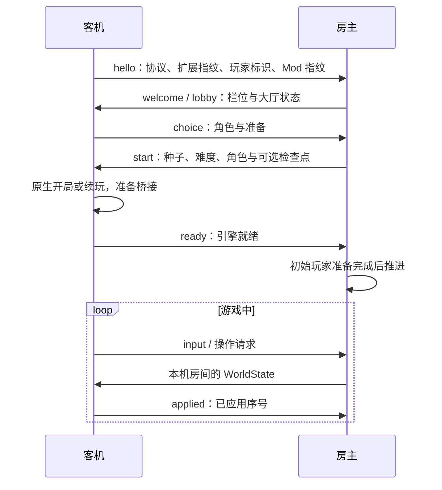
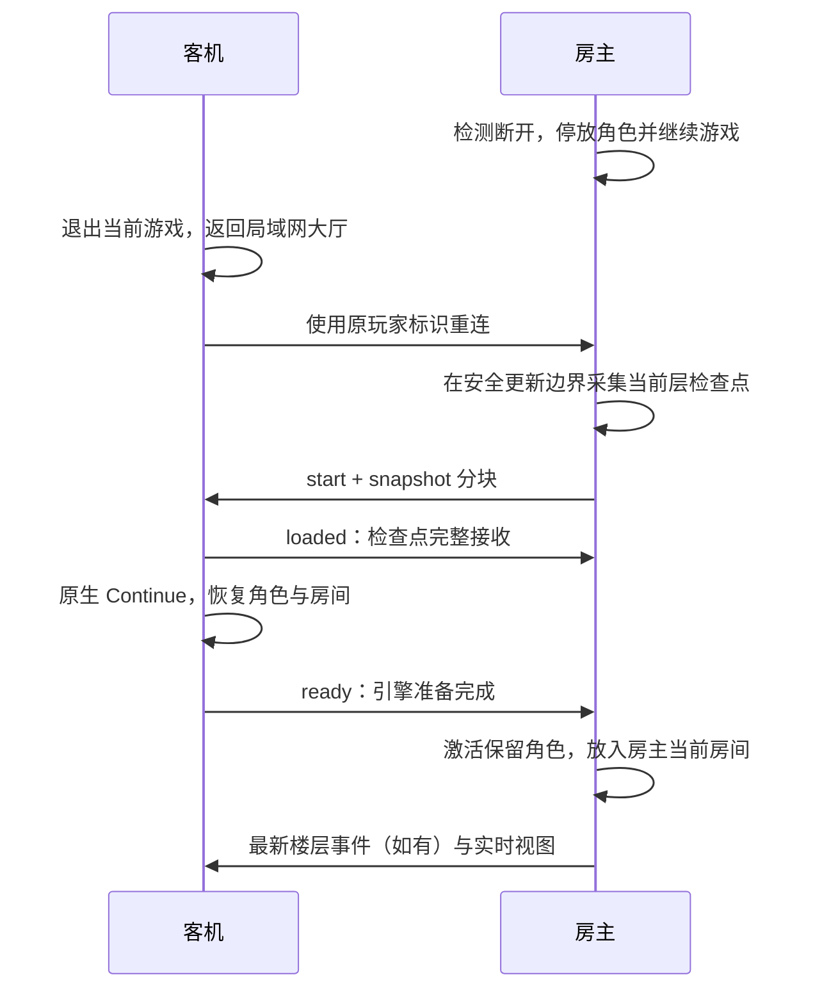

# 会话与状态恢复

## 大厅与开局

房主监听 IPv4 TCP。客机连接后发送协议版本、联机扩展指纹、玩家标识和 Mod 指纹。前两项必须一致，Mod 差异只做提示。加入失败不会把客机改成房主。

玩家在大厅选择角色、准备，由房主发布种子、难度和角色顺序。原生游戏启动后，桥接代码创建或恢复角色、绑定控制器、启用分房上下文，再发送引擎就绪信息。

网络状态机定义在 [`net/protocol.h`](../src/net/protocol.h)。`loading` 表示收到的检查点尚未传完；传完后仍需原生加载与 `ready`，不能只凭网络状态为 `running` 就参与战斗。

## 原生换层与重建

房主在触发原生换层时立即发布 `Stage`，而不是等到下一层加载完，才让客机从状态包猜测换层。

事件包含楼层、类型、动画、`floorEpoch` 和需要的 Seeds 字段。在线客机收到事件后进入对应原生过场；网络传输和加载速度仍会影响实际播放时间。

原生换层完成后重新接入分房上下文，再应用新楼层视图。预测和旧楼层实体映射按事务清理。普通在线换层不会走完整检查点传输与 Continue 重建。

重置当前层和 R 键会改变原生种子或拓扑。Seeds 与事件一起同步；R 键使用原生立即重启路径。恢复新楼层视图前必须准备正确的描述符和房间布局。

## 暂停与退出

任何在线玩家可以请求全队暂停，由发起者恢复。暂停状态与发起者随视图同步；退出或掉线本身不会发起全队暂停。

只有房主可以保存并结束会话。客机单独离开时，房主移出其活动角色，保留道具和主要状态。离线角色不参与战斗和奖励人数计算。

退出、换层和房间迁移在安全的更新边界执行，避免原生函数返回到已释放的房间、角色或镜头对象。

## 当前层重连

客机不需要从第一层重放输入，也不必等下一层。已离线栏位通过 `player-id.txt` 识别；它用于匹配运行中的原角色。当前没有中途增加新玩家或房主迁移流程。

[`runtime/session.cpp`](../src/runtime/session.cpp) 在所有已加载房间完成原生保存后采集检查点，临时把停放角色放入存档名单。这个名单只用于序列化，不让离线角色重新参加战斗。

加载期间房主继续推进。客机发送 `ready` 前不提交有效玩法输入，也不计入在线人数。准备完成后接收最新视图，使用保留的原角色及状态回到房主当前房间。

如果房主在客机加载期间换层，连接保存最新楼层事件，在 `ready` 后先交付事件，再交付实时视图；楼层代次也用于发现需要继续准备的楼层。

当前检查点采用原版保存／续玩的恢复行为，不是逐字节恢复运行中实体。道具、血量等主要状态由原生存档恢复，临时实体与部分计时可能重新生成或重置。

## 联机存档与续玩

[`session_archive.h`](../src/runtime/session_archive.h) 的存档包含扩展指纹、开局设置、全队房间与位置、原生 GameState 数据和完整性哈希。格式标识为 `IsaacLAN/save/2`。

房主三个存档栏分别使用游戏目录下的 `isaac-lan/session-1.bin`、`session-2.bin`、`session-3.bin`。联机会话保存与原有单机 Continue 状态分别管理。

整场关闭后的续玩仍要求原房主使用原存档栏，并按原人数、原加入顺序集合。运行中重连的玩家标识匹配与整场续玩的栏位顺序是两套不同条件。

## 全队回退

发光沙漏使用 [`engine/versions/j460/rewind.cpp`](../src/engine/versions/j460/rewind.cpp) 保存的每个控制器上一次进房检查点。检查点记录当时全队的原生状态与各自位置。

房主接受使用请求后发布带回退载荷的可靠 `Stage` 事务，两端使用原生沙漏恢复路径，再恢复各玩家当时的房间。回退可能跨层；网络状态序号继续递增，楼层代次推进，不能重新接纳回退前的旧视图。

## 失败边界

单个客机连接的协议错误或超时会使房主移除该连接并继续运行。客机状态应用或桥接出错时返回大厅，可以尝试重连；重连仍需要原会话存在、玩家标识匹配和扩展版本一致。

房主自身的桥接或原生适配错误属于会话级故障，可能结束整场会话，不能按普通客机掉线处理。

完整性哈希只用于数据传输与存档，不用来因双方随机序列不同而踢出玩家。具体错误应结合两端日志定位，不能把所有断开都归结为失步校验。
